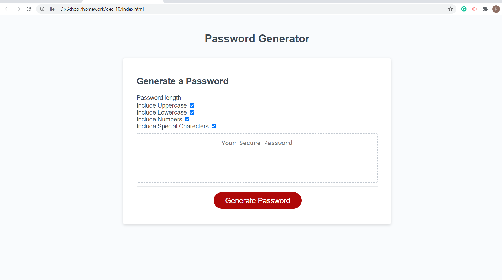

# shuffling_passwords #
This website is designed to generate a random secure password with different peramiters that can be selected by the user. The interface has a text area where the user can input the amount of charecters they would like as well as four checkboxes that control uppercase, number, symbol, and lowercase charecters. When onw is checked, it will show up in the password. At the bottom of the page there is a button used to generate the password, and append it to the text area above. 

# Differnce in assignment #
I do not believe that useing mulitple prompts is the most user friendly way of gathering information from the user. Instead I wrote some input elements into the HTML and coded them using Javascript for the same effect. The only pop up that I used was an alert to tell the user that they have to mant or not enouph of the charecters reuqired to run the program.

# Screenshot of Website #

# Link to Website #
 https://rryanwilsonw.github.io/shuffling_passwords/
 
